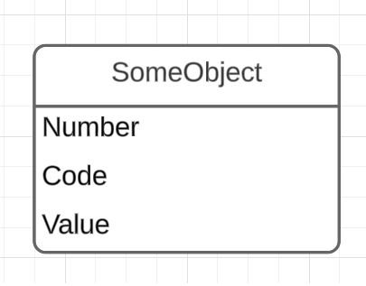

# Finstar Financial Group - Test Project

## Overview
This is a test project developed for **Finstar Financial Group**.

### SomeObjects ER diagram


To check types and constraints used for table's columns, please check [model snapshot](src/Migrations/FinstarTestTaskDbContextModelSnapshot.cs#L24).

## Prerequisites
Ensure you have the following installed before running the project:
- [.NET 9 SDK](https://dotnet.microsoft.com/download/dotnet/9.0)
- [Microsoft SQL Server](https://www.microsoft.com/en-us/sql-server/sql-server-downloads)
- [Entity Framework Core 9](https://learn.microsoft.com/en-us/ef/)

## Getting Started
1. **Clone the repository**:
   ```sh
   git clone https://github.com/RomanTishchenko2021/finstar-test-task-server.git
   cd finstar-test-task-server
   ```

2. **Set up the database**:
   - Update the connection string in `appsettings.Development.json`.
   - Apply migrations:
     ```sh
     dotnet ef database update
     ```

3. **Run the application**:
   ```sh
   dotnet run
   ```

## API Endpoints
Refer to the API documentation or Swagger UI for available endpoints.

## License
This project is for internal testing purposes and is not intended for public distribution.

